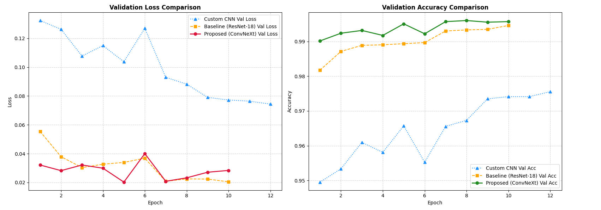
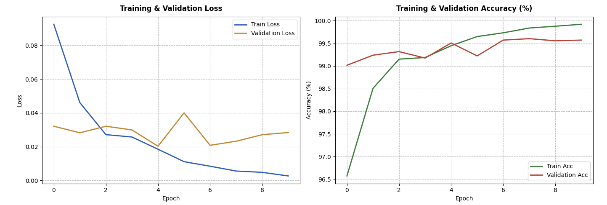

<div align="center">

# 🔥 Wildfire Detection & Classification from Satellite Imagery
### *Deep Learning Term Project (CENG 476 - Introduction to Deep Learning)*

<p align="center">
  
  
  
  
</p>

</div>

---

## 📋 Table of Contents
- [📌 Project Overview](#-project-overview)
- [📊 Dataset & Preprocessing](#-dataset--preprocessing)
- [🧠 Model Architectures](#-model-architectures)
- [📈 Experimental Results](#-experimental-results)
- [📉 Visualizations & Confusion Matrices](#-visualizations--confusion-matrices)
- [⚙️ Getting Started](#️-getting-started)
- [👥 Author](#-author)

---

## 📌 Project Overview
This repository contains a rigorous deep learning implementation for **Wildfire Detection and Classification using Satellite Imagery**. The primary objective is to evaluate the performance differences between a lightweight Convolutional Neural Network built from scratch versus state-of-the-art transfer learning architectures (`ResNet-18` and `ConvNeXt-Tiny`) equipped with advanced regularization strategies (AdamW, Batch Normalization, Cosine Annealing, and Early Stopping).

---

## 📊 Dataset & Preprocessing
The project utilizes the **Kaggle Wildfire Prediction Dataset**, consisting of high-resolution satellite/aerial images divided into binary classes (*No Wildfire* vs. *Wildfire*).

* **Input Dimension:** Resized from $300 \times 300$ to **$224 \times 224$** pixels.
* **Normalization:** ImageNet mean (`[0.485, 0.456, 0.406]`) and standard deviation (`[0.229, 0.224, 0.225]`).
* **Data Augmentation:** Random Horizontal/Vertical Flips, Random Rotations ($\pm 25^\circ$), and Color Jitter.

| Dataset Split | No Wildfire (0) | Wildfire (1) | Total Images | Ratio |
| :--- | :---: | :---: | :---: | :---: |
| **Train Set** | 14,500 | 15,750 | 30,250 | ~70% |
| **Validation Set** | 2,820 | 3,480 | 6,300 | ~15% |
| **Test Set** | 2,820 | 3,480 | 6,300 | ~15% |

---

## 🧠 Model Architectures
1. **Custom CNN (Baseline from Scratch):** 3 sequential Conv-BN-ReLU-MaxPool blocks followed by an Adaptive Average Pooling layer and a fully connected classification head.
2. **ResNet-18 (Transfer Learning):** Residual shortcut connections across 18 layers initialized with ImageNet weights.
3. **ConvNeXt-Tiny (Proposed SOTA):** Modernized macro-design architecture combining transformer-inspired efficiency with hierarchical visual feature extraction.

---

## 📈 Experimental Results

All models were evaluated on the independent test set (6,300 images) using PyTorch with Automatic Mixed Precision (AMP):

| Model Architecture | Test Accuracy (%) | Macro Precision | Macro Recall | Macro F1-Score | ROC-AUC |
| :--- | :---: | :---: | :---: | :---: | :---: |
| **Custom CNN (Scratch)** | 98.05% | 0.9807 | 0.9798 | 0.9802 | 0.9982 |
| **ResNet-18 (Pretrained)** | 99.56% | 0.9953 | 0.9957 | 0.9955 | 0.9998 |
| **ConvNeXt-Tiny (Proposed)** | **99.67%** | **0.9966** | **0.9966** | **0.9963** | **0.9999** |

---

## 📉 Visualizations & Results

### 1. Multi-Model Performance Comparison


### 2. Single Model Training & Validation Progress Curves


## ⚙️ Getting Started

### Prerequisites
Ensure you have Python 3.10+ and a CUDA-compatible GPU installed.

### Installation
1. Clone the repository:
   ```bash
   git clone [https://github.com/YOUR_USERNAME/wildfire-prediction-deep-learning.git](https://github.com/YOUR_USERNAME/wildfire-prediction-deep-learning.git)
   cd wildfire-prediction-deep-learning
